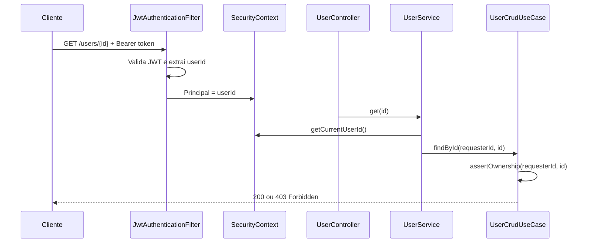

# auth-ms

Microserviço de autenticação e gerenciamento de usuários do ecossistema **video-to-image**. Responsável por cadastro, login com JWT, CRUD de perfil e publicação de eventos de domínio via SQS.

O código da aplicação está no diretório [`auth-ms/`](auth-ms/).

## Sumário

- [Conceito: autenticação centralizada, autorização descentralizada](#conceito-autenticação-centralizada-autorização-descentralizada)
- [Stack](#stack)
- [Arquitetura](#arquitetura)
- [API](#api)
- [Eventos SQS](#eventos-sqs)
- [Pré-requisitos](#pré-requisitos)
- [Rodando localmente](#rodando-localmente)
- [Docker](#docker)
- [Variáveis de ambiente](#variáveis-de-ambiente)
- [Banco de dados e Mongock](#banco-de-dados-e-mongock)
- [Testes](#testes)
- [Swagger](#swagger)

---

## Conceito: autenticação centralizada, autorização descentralizada

Este serviço concentra **quem o usuário é** e **se as credenciais são válidas**. Os demais microserviços do ecossistema não implementam login nem emitem tokens — eles apenas **validam o JWT** recebido e decidem **o que aquele usuário pode fazer** em seu próprio domínio.

| Responsabilidade | Onde fica | Exemplo |
|------------------|-----------|---------|
| **Autenticação** (centralizada) | `auth-ms` | Login, emissão de JWT, cadastro, hash de senha |
| **Autorização** (descentralizada) | Cada microserviço consumidor | "Este usuário pode processar este vídeo?", "Pode acessar este bucket?" |

### O que o auth-ms faz

- Registra usuários (`POST /users`)
- Autentica e emite JWT HS256 (`POST /auth/login`)
- Garante que cada usuário só acessa **o próprio** recurso (`GET/PUT/DELETE /users/{id}` com validação de ownership)
- Publica eventos `user-created` e `user-deleted` para que outros serviços reajam sem acoplamento direto

### O que os consumidores fazem

1. Recebem o header `Authorization: Bearer <token>` do cliente
2. Validam assinatura e expiração do JWT (mesmo `JWT_SECRET` ou chave pública, conforme estratégia)
3. Extraem claims (`userId`, `email`, `name`) e aplicam **suas próprias regras de autorização**
---

## Stack

| Tecnologia | Versão / detalhe |
|------------|------------------|
| Java | 17 |
| Spring Boot | 4.1.0 |
| Spring Security | JWT stateless (HS256) |
| Spring Data MongoDB | DocumentDB / MongoDB 7 (dev) |
| Mongock | Migrations e índices versionados |
| Spring Cloud AWS SQS | 4.0.2 |
| MapStruct | 1.6.3 |
| Springdoc OpenAPI | 2.8.5 |
| JJWT | 0.12.6 |

---

## Arquitetura

O projeto segue **Arquitetura Hexagonal (Ports & Adapters)**. O núcleo (`core/`) não depende de Spring, MongoDB ou AWS; a infraestrutura (`infra/`) implementa os adaptadores.

```
auth-ms/src/main/java/video/to/image/auth_ms/
├── core/
│   ├── domain/           # Entidades, exceções de domínio
│   └── application/      # Ports (in/out) e use cases
└── infra/
    ├── adapters/inbound/web/     # Controllers, DTOs, JWT filter
    ├── adapters/outbound/        # MongoDB, BCrypt, JWT generator
    ├── broker/                   # Publicação SQS
    └── config/                   # Beans Spring, Security, properties
```

### Fluxo de uma requisição autenticada



### Camadas e responsabilidades

| Camada | Pacote | Responsabilidade |
|--------|--------|------------------|
| Domain | `core.domain` | `User`, `AuthResult`, exceções |
| Application | `core.application` | `AuthenticateUseCase`, `UserCrudUseCase`, ports |
| Inbound | `infra.adapters.inbound.web` | REST API, segurança HTTP, DTOs |
| Outbound persistence | `infra.adapters.outbound.persistence` | MongoDB, repositórios |
| Outbound security | `infra.adapters.outbound.security` | BCrypt, geração JWT |
| Broker | `infra.broker` | `UserEventPublisher` → SQS |

---

## API

**Base URL:** `http://localhost:8082`

| Método | Endpoint | Autenticação | Descrição |
|--------|----------|--------------|-----------|
| `POST` | `/auth/login` | Pública | Login e obtenção do JWT |
| `POST` | `/users` | Pública | Cadastro de usuário |
| `GET` | `/users/{id}` | JWT | Buscar perfil (apenas o próprio) |
| `PUT` | `/users/{id}` | JWT | Atualizar nome (apenas o próprio) |
| `DELETE` | `/users/{id}` | JWT | Excluir conta (apenas o próprio) |

### Claims do JWT

| Claim | Conteúdo |
|-------|----------|
| `sub` | UUID do usuário |
| `userId` | UUID do usuário |
| `email` | E-mail |
| `name` | Nome |
| `exp` | Expiração (padrão: 24h) |

### Exemplos com curl

**Cadastro:**

```bash
curl -X POST http://localhost:8082/users \
  -H "Content-Type: application/json" \
  -d '{"name":"João","email":"joao@email.com","password":"senha123"}'
```

**Login:**

```bash
curl -X POST http://localhost:8082/auth/login \
  -H "Content-Type: application/json" \
  -d '{"email":"joao@email.com","password":"senha123"}'
```

**Buscar perfil (substitua `{id}` e `{token}`):**

```bash
curl http://localhost:8082/users/{id} \
  -H "Authorization: Bearer {token}"
```

### Códigos de erro

| HTTP | Situação |
|------|----------|
| 400 | Validação de entrada |
| 401 | Credenciais inválidas ou token ausente/expirado |
| 403 | Tentativa de acessar recurso de outro usuário |
| 404 | Usuário não encontrado |
| 409 | E-mail já cadastrado |

---

## Eventos SQS

Quando um usuário é criado ou excluído, o serviço publica mensagens JSON para filas SQS. Outros microserviços consomem essas filas para provisionar ou remover recursos associados ao usuário.

| Evento | Fila | Payload | Quando |
|--------|------|---------|--------|
| User created | `user-created-queue` | `{ "userId": "<uuid>" }` | Após `POST /users` |
| User deleted | `user-deleted-queue` | `{ "userId": "<uuid>" }` | Após `DELETE /users/{id}` |

### LocalStack (desenvolvimento)

O `docker-compose` sobe o LocalStack com SQS na porta `4566`. Um script de init cria as filas automaticamente:

- [`auth-ms/localstack/init/create-queues.sh`](auth-ms/localstack/init/create-queues.sh)

**Verificar mensagens na fila:**

```bash
aws --endpoint-url=http://localhost:4566 sqs receive-message \
  --queue-url http://sqs.us-east-1.localhost.localstack.cloud:4566/000000000000/user-created-queue
```

### AWS (produção)

Em produção, remova ou não defina `spring.cloud.aws.sqs.endpoint`. O SDK usará o SQS real da AWS com as credenciais/IAM role do ambiente (ECS task role, EC2 instance profile, etc.).

Crie as filas na AWS (ex.: via Terraform/CloudFormation) com os mesmos nomes configurados em `app.sqs.*` ou sobrescreva via variáveis de ambiente.

| Propriedade | Local (LocalStack) | AWS |
|-------------|-------------------|-----|
| `spring.cloud.aws.sqs.endpoint` | `http://localhost:4566` | *(não definir)* |
| `spring.cloud.aws.region.static` | `us-east-1` | região do deploy |
| Credenciais | `test` / `test` | IAM role / credenciais do ambiente |

---

## Pré-requisitos

- **Java 17**
- **Maven** (ou use o wrapper `./mvnw` incluído no projeto)
- **Docker** e **Docker Compose**
- **AWS CLI** (opcional, para inspecionar filas no LocalStack)
- **MongoDB** (via Docker Compose, compatível com DocumentDB)

---

## Rodando localmente

Todos os comandos abaixo assumem o diretório `auth-ms/` (onde estão `pom.xml`, `Dockerfile` e `docker-compose.yml`):

```bash
cd auth-ms
```

### 1. Subir MongoDB e LocalStack

```bash
docker compose up -d mongo localstack
```

Aguarde o MongoDB e o LocalStack estarem prontos:

```bash
docker compose logs -f mongo localstack
```
---
**Customizar JWT secret:**

```bash
JWT_SECRET=seu-secret-com-pelo-menos-32-caracteres docker compose up --build
```

> Defina `JWT_SECRET` no ambiente do host antes do `docker compose up`. O valor é lido pelo Spring via `jwt.secret=${JWT_SECRET:...}` em `application.properties`.

---

### Dockerfile

Build multi-stage em [`auth-ms/Dockerfile`](auth-ms/Dockerfile):

1. **Build:** `maven:3.9-eclipse-temurin-17` — resolve dependências e gera o JAR
2. **Runtime:** `eclipse-temurin:17-jre-alpine` — executa como usuário não-root

```bash
cd auth-ms
docker build -t auth-ms:local .
docker run -p 8082:8082 \
  -e SPRING_MONGODB_URI=mongodb://host.docker.internal:27017/auth_ms \
  -e SPRING_CLOUD_AWS_SQS_ENDPOINT=http://host.docker.internal:4566 \
  --add-host=host.docker.internal:host-gateway \
  auth-ms:local
```
---

## Docker

### Subir stack completa (app + MongoDB + LocalStack)

```bash
cd auth-ms
docker compose up --build
```

O container `auth-ms` conecta ao MongoDB pelo hostname `mongo` e ao LocalStack pelo hostname `localstack`.

### Fluxo completo de validação

```bash
# 1. Criar usuário
curl -s -X POST http://localhost:8082/users \
  -H "Content-Type: application/json" \
  -d '{"name":"Teste","email":"teste@email.com","password":"senha123"}'

# 2. Login (copie o token da resposta)
curl -s -X POST http://localhost:8082/auth/login \
  -H "Content-Type: application/json" \
  -d '{"email":"teste@email.com","password":"senha123"}'

# 3. Verificar evento na fila
aws --endpoint-url=http://localhost:4566 sqs receive-message \
  --queue-url http://sqs.us-east-1.localhost.localstack.cloud:4566/000000000000/user-created-queue
# 4. Inspecionar dados no MongoDB
docker compose exec mongo mongosh auth_ms --eval 'db.tb_user.find().pretty()'
```
---

### Coleção `tb_user`

| Campo | Tipo | Constraints |
|-------|------|-------------|
| `id` | UUID | PK (`@Id`) |
| `name` | String | opcional |
| `email` | String | único (índice Mongock) |
| `password` | String | BCrypt |

### Adicionar novas migrations

1. Crie uma nova classe `@ChangeUnit` em `infra/migrations/`
2. Defina `id`, `order` e `author` únicos
3. O Mongock registra o histórico na coleção `mongockChangeLog`

> Nunca altere ChangeUnits já aplicados; sempre crie novos com `order` incrementado.

### Mongock em produção (ASG / múltiplas instâncias)

O Mongock usa lock distribuído no MongoDB. Migrations já aplicadas são ignoradas. Para deploys com índice novo em escala, considere rodar migrations uma única vez no CI/CD antes do deploy.

---

## Testes

```bash
cd auth-ms
./mvnw test
```

O teste de contexto (`AuthMsApplicationTests`) desabilita SQS e Mongock e mocka `UserEventPublisher` e `MongoUserRepository`.

---

## Swagger

Documentação interativa disponível em:

- **Swagger UI:** http://localhost:8082/swagger-ui.html
- **OpenAPI JSON:** http://localhost:8082/v3/api-docs

---

## Estrutura do repositório

```
.
├── README.md                 # Este arquivo
└── auth-ms/                  # Projeto Spring Boot
    ├── Dockerfile
    ├── docker-compose.yml
    ├── pom.xml
    ├── mvnw
    ├── localstack/
    │   └── init/
    │       └── create-queues.sh
    └── src/
        ├── main/
        │   ├── java/...
        │   └── resources/
        │       ├── application.properties
        │       └── (migrations em infra/migrations/)
        └── test/
```

---
